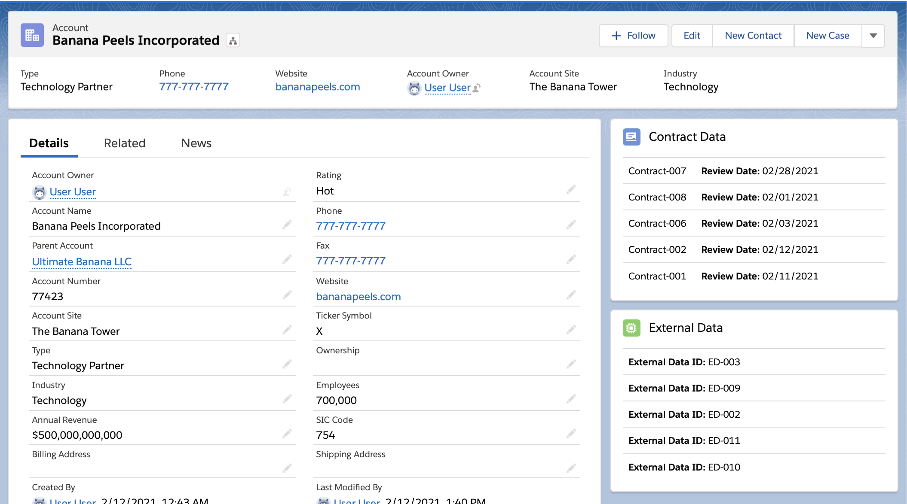
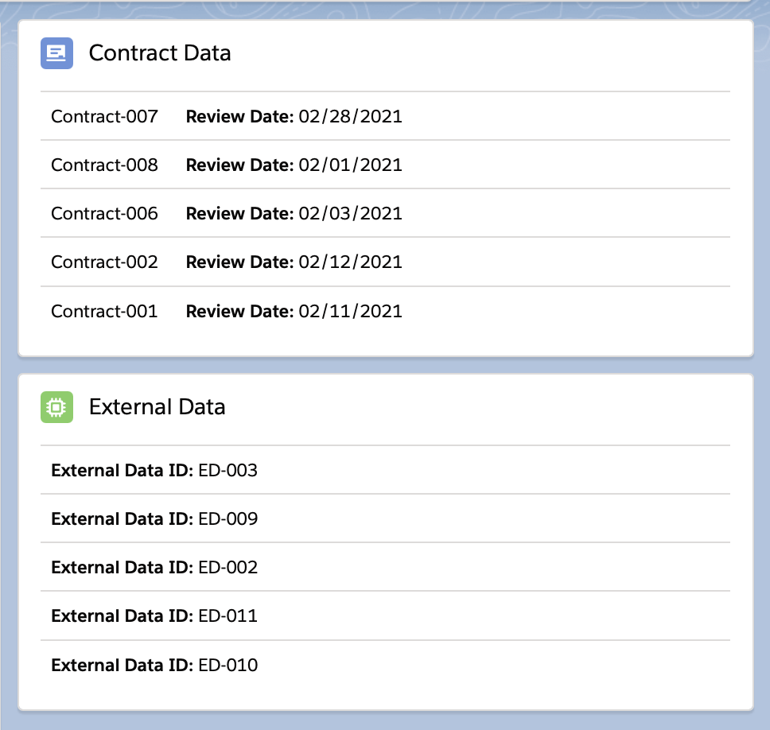
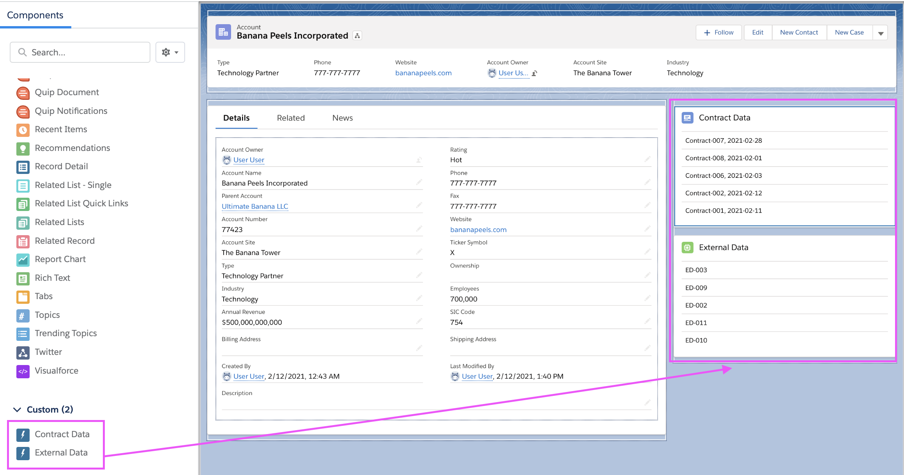

# JumpCloud Interview Assignment
<p align="center">
    <a href="https://github.com/MissSherBear/jumpcloudtest/issues">
      
    </a>
    <a href="https://github.com/MissSherBear/jumpcloudtest/pulls">
      
    </a>
    </p>



1. [About](#about)
1. [Installation](#installation)
    - [Using SFDX](#using-sfdx)
    - [Load Sample Data](#load-sample-data)
1. [Documentation](#documentation)
    - [externalData Component](#externalData-component)
    - [contractData Component](#contractData-component)
    - [ExternalContractController](#externalContractController)
    - [How to Display Components on a Lightning Record Page](#getting-started) 
1. [Bonus Questions](#bonus-questions)

## About
This repository is composed of two lightning web components which show Account related records from the two custom objects, External_Data__c and Contract_Data__c. These are generic and customizable components built using Salesforce [Lightning Web Components](https://developer.salesforce.com/docs/component-library/documentation/lwc) and [SLDS](https://www.lightningdesignsystem.com/) style.



## Installation
### Using SFDX
1. Clone this repo
```
git clone 
https://github.com/MissSherBear/jumpcloudtest.git
```
2. Direct to the root
```
cd jumpcloudtest/
```
3. Deploy to your desired org
```
sfdx force:source:deploy 
```

### Load Sample Data
1. Export the data in your default scratch org.
Use the force:data:soql:query command to fine-tune the SELECT query so that it returns the exact set of data you want to export.
```
sfdx force:data:soql:query --query 
    "SELECT Id, Name, 
        (SELECT Name FROM External_Data__r), 
        (SELECT Name, Review_Date__c FROM Contract_Data__r) 
     FROM Account"
```
2. Use the SELECT statement to export the data as plan for single file import. The command runs from .sfdx so a relative path will be added for ../data. The JSON files include a plan definition file which shows the other files containing each exported object.
```
sfdx force:data:tree:export -p --prefix export-demo -d ../data/ -q 
    "SELECT Id, Name, 
        (SELECT Name FROM External_Data__r), 
        (SELECT Name, Review_Date__c FROM Contract_Data__r) 
     FROM Account" 
```
3. Import the data into your org by specifying the plan definition file. The `--plan` parameter to specify the full path name of the plan execution file generated by the `force:data:tree:export` command. 
```c
sfdx force:data:tree:import -p export-demo-Account-External_Data__c-Contract_Data__c-plan.json
```

## Documentation
I created two custom objects labeled External_Data__c and Contract_Data__c. Set the Salesforce default "Name" field to an auto-number on both objects. On each object, I created a custom lookup field named Account__c which is a lookup relationship to the standard Account object. For the Contract Data object, I created a custom date field named Review_Date__c. Then I created two Lightning Web Components labeled contractData and externalData which display related External_Data__c and Contract_Data__c records on an Account detail page. I modified the component markup to format the Review_Date__c field to be displayed as MM/DD/YYYY on the contractData card.
### externalData Component
Component Markup:
```html
<template>
    <lightning-card title="External Data" icon-name="custom:custom63">
        <div class="slds-m-around_medium">
            <ul class="slds-list_vertical slds-has-dividers_top-space">
                <template for:each={external.data} for:item="ex" if:true={external.data}>
                    <li key={ex.Id} class="slds-list__item">
                        <strong>External Data ID: </strong>{ex.Name}
                    </li>
                </template>
            <template if:true={external.error}>
                <li class="slds-list__item"><h3 class="slds-text-heading_small slds-text-color_error">{external.error}</h3></li>
            </template>
        </ul>
        </div>
    </lightning-card>
</template>
```
JavaScript File:
```js
import { LightningElement, wire, api } from 'lwc';
import getExternalList from '@salesforce/apex/ExternalContractController.getExternalList';

export default class ExternalData extends LightningElement {
// Flexipage gives us the recordId and objectApiName
 @api recordId;
 @api objectApiName;
 fields = ['Name']; 
// Calling the Apex method using Wire Decorator with a Parameter
 @wire(getExternalList, { accId: '$recordId' }) 
 external;
}
```
### contractData Component
Component Markup:
```html
<template>
    <lightning-card title="Contract Data" icon-name="custom:custom62">
        <div class="slds-m-around_medium">
            <ul class="slds-list_vertical slds-has-dividers_top-space">
                <template for:each={contract.data} for:item="con" if:true={contract.data}>
                    <li key={con.Id} class="slds-list__item">
                        {con.Name}&nbsp;&nbsp;&nbsp;&nbsp;   
                        <strong>&nbsp;&nbsp;Review Date: </strong><lightning-formatted-date-time value={con.Review_Date__c} year="numeric" month="2-digit" day="2-digit" time-zone="UTC"></lightning-formatted-date-time>
                    </li>
                </template>
            <template if:true={contract.error}>
                <li class="slds-list__item"><h3 class="slds-text-heading_small slds-text-color_error">{contract.error}</h3></li>
            </template>
        </ul>
        </div>
    </lightning-card>
</template>
```
JavaScript File:
```js
import { LightningElement, wire, api } from 'lwc';
import getContractList from '@salesforce/apex/ExternalContractController.getContractList';

export default class ContractData extends LightningElement {
    
// Flexipage gives us the recordId and objectApiName of the parent Account record on the current page
 @api recordId;
 @api objectApiName;
 fields = ['Name']; 
// Calling the Apex method using Wire Decorator with a Parameter
 @wire(getContractList, { accId: '$recordId' }) 
 contract;
}
```
### ExternalContractController
Both components are managed by a single Apex controller class named ExternalContractController. The controller class filters the related records shown on each component based on the parent AccountId and returns a method for each related object. This ensures that the Account__c lookup field matches the AccountId.<br>

Apex Class:
```cls
public with sharing class ExternalContractController {

    // This method returns all External_Data__c records with a matching AccountId
    @AuraEnabled(cacheable=true)
    public static List<External_Data__c> getExternalList(Id accId){
        system.debug('accId is: '+ accId);
        return [SELECT Id, Name FROM External_Data__c WHERE Account__c = :accId];
    }

    // This method returns all Contract_Data__c records with a matching AccountId
    @AuraEnabled(cacheable=true)
    public static List<Contract_Data__c> getContractList(Id accId){
        system.debug('accId is: '+ accId);
        return [SELECT Id, Name, Review_Date__c FROM Contract_Data__c WHERE Account__c = :accId];
    }
}
```
Test Class:
```cls
@istest
private class ExternalContractControllerTest {
    @istest static void testBehavior() {

        // Creates test Account data to be used in methods
        account a = new account();
        a.Name = 'Banana Peels Incorporated';
        insert a;

        // Creates test External Data and Contract Data related records based on the Account record above 
        External_Data__c e = new External_Data__c();
        e.Account__c = a.Id;
        insert e;

        Contract_Data__c c = new Contract_Data__c();
        c.Account__c = a.Id;
        insert c;
        
        // System.assertNotEquals() checks to see if the test works as expected. Verifies the related records were created and have a matching AccountId
        Test.startTest();
        System.assertNotEquals(null, ExternalContractController.getExternalList(a.Id));
        System.assertNotEquals(null, ExternalContractController.getContractList(a.Id));
        Test.stopTest();
        
        // Used the Test.startTest() and Test.stopTest() statements to increase Governor Limits on my test class

    }
}
```

### Getting Started 
<b>How to use the related list on your lightning record page:</b>
1. Navigate to the parent Account object record page and click edit page from the gear icon.
2. Drag the Contract Data and External Data components to the desired space on your page.
3. The related records will appear inside the component card body.



## Bonus Questions
#### 1. <b>How would you split up these two Lighting Web Components into two different projects that could be deployed independently, but share the same .sfdx project?</b> 
This can be solved by using two separate SFDX Package Directories where you can deploy packages independently of each other.<br> 
#### 2. <b>How would you separate permissions to make sure each of these projects are truly independent?</b>
Using `default/main` tells the CLI where to save new metadata. You can organize the different metadata files for each project by putting the files into modules that are siblings to `main` inside of your default directory. The CLI is smart enough to remember where specific source files are located after you do your initial source push. From there on out every time you do a pull, the correct file will be updated automatically.

