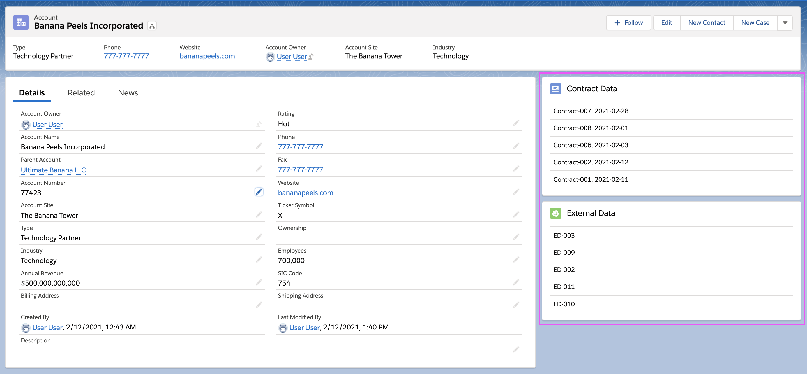

# JumpCloud Interview Assignment


1. [About](#about)
1. [Installation](#installation)
    - [Using SFDX](#using-sfdx)
    - [Using meta-data](using-meta-data)
    - [Load Sample Data](#load-sample-data)
1. [Documentation](#documentation)
    - [How to Display Components on a Lightning Record Page](#getting-started) 

## About
This repository is composed of two lightning web components which show Account related records from the two custom objects External Data and Contract Data. These are generic and customizable components built using Salesforce [Lightning Web Components](https://developer.salesforce.com/docs/component-library/documentation/lwc) and [SLDS](https://www.lightningdesignsystem.com/) style.
It does not rely on third party libraries and you have full control over its datasource.

## Installation
### Using SFDX
1. Clone this repo
```
git clone 
https://github.com/MissSherBear/jumpcloudtest.git
```
2. Direct to the root
```
cd jumpcloudtest/
```
3. Deploy to your desired org
```
sfdx force:source:deploy -p sf_relatedList -u $YOURORGNAME
```

### Using meta-data
1. Clone this repo
```
git clone https://github.com/libra34567/lightningRelatedListWithFilter.git
```
2. Direct to the root/package
```
cd lightningRelatedListWithFilter/package
```
3. Ant deploy the package
```
```
### Load Sample Data
1. Export the data in your default scratch org.
Use the force:data:soql:query command to fine-tune the SELECT query so that it returns the exact set of data you want to export.
```
sfdx force:data:soql:query --query "SELECT Id, Name, (SELECT Name FROM External_Data__r), (SELECT Name, Review_Date__c FROM Contract_Data__r) FROM Account"
```
2. Use the SELECT statement to export the data as plan for single file import. The command runs from .sfdx so a relative path will be added for ../data. The JSON files include a plan definition file which shows the other files containing each exported object.
```
sfdx force:data:tree:export -p --prefix export-demo -d ../data/ -q "SELECT Id, Name, (SELECT Name FROM External_Data__r), (SELECT Name, Review_Date__c FROM Contract_Data__r) FROM Account" 
```
3. Import the data into your org by specifying the plan definition file. The `--plan` parameter to specify the full path name of the plan execution file generated by the `force:data:tree:export` command. 
```c
sfdx force:data:tree:import -p export-demo-Account-External_Data__c-Contract_Data__c-plan.json
```

## Documentation
### Getting Started 
<b>How to use the related list on your lightning record page:</b>
1. Navigate to the parent Account object record page and click edit page from the gear icon.
2. Drag the Contract Data and External Data components to the desired space on your page.
3. The related records will appear inside the component card body.


